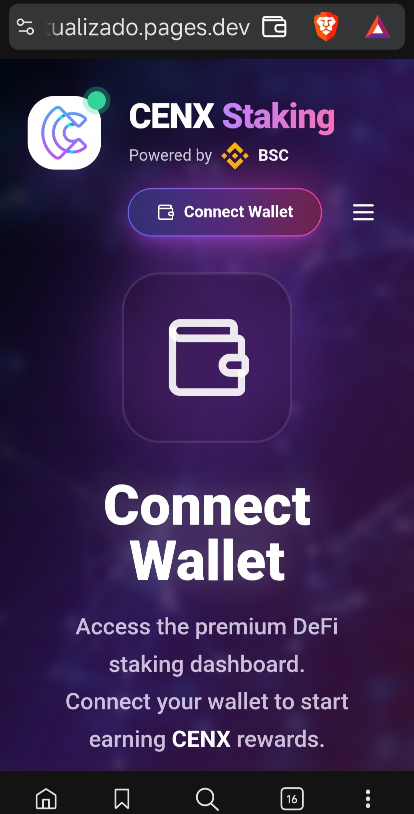
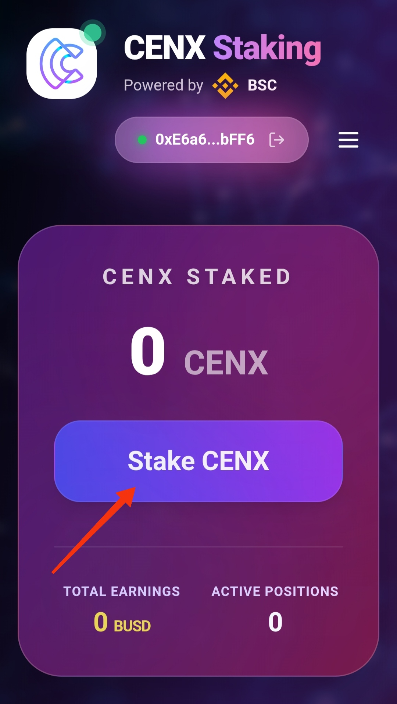
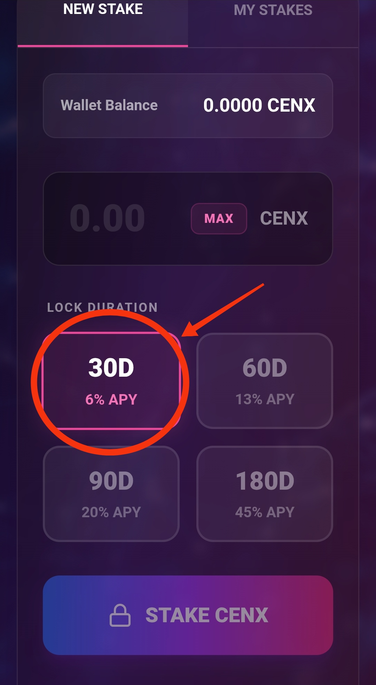
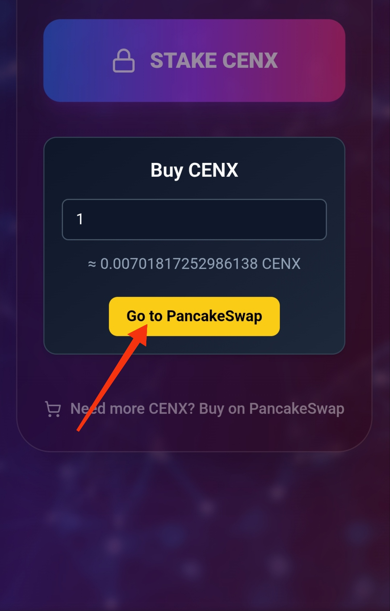
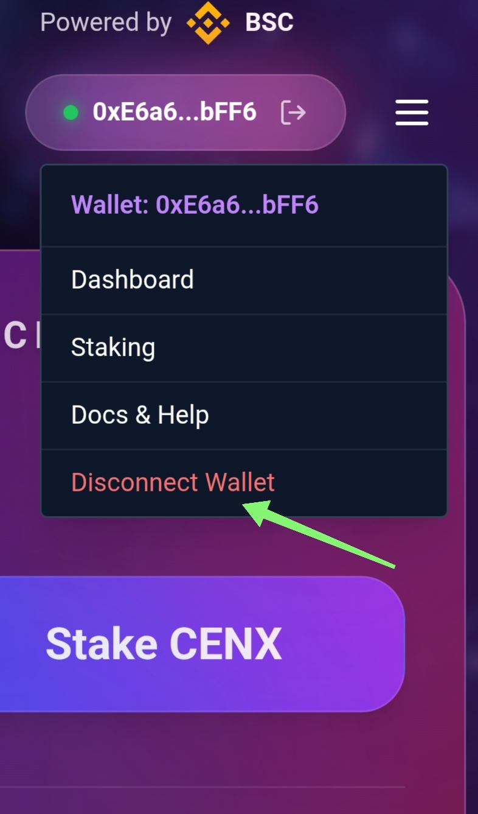
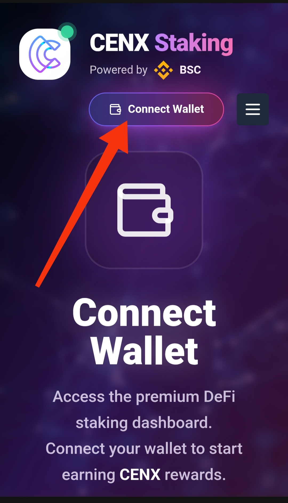

# Hi there, I'm Pedro Santos 👋

**Web3 QA Strategist & Frontend Developer**  
Specialized in premium staking dApps, smart contract testing, and blockchain frontend experiences.

🔹 Expert in React, Vite, Wagmi/Viem, Tailwind  
🔹 QA Testing for Solana & Ethereum ecosystems  
🔹 Building responsive, user-focused DeFi interfaces

### 🚀 Featured Project: Centcex Staking dApp

Premium frontend for CENX staking on BSC – wallet connect, flexible lock periods, APY plans, approve/stake logic, and token purchase integration.  

[Live Demo](https://tualizado.pages.dev) | [Repository](https://github.com/pedrosantos-tech/centcex_project)

#### Screenshots

**Dashboard Overview**  
  
*Total staked CENX, earnings tracking, and quick stake access*

**New Stake Tab**  
  
*Amount input, MAX button, and flexible lock duration plans (6%–45% APY)*

**Lock Duration Selection**  
  
*Interactive plan selection with visual feedback*

**Buy CENX Modal**  
  
*Seamless token purchase with real-time price estimate via PancakeSwap*

**Wallet Menu**  
  
*Connected wallet address with secure disconnect option*

**Connect Wallet Landing**  
  
*Premium entry screen for MetaMask/TrustWallet connection*

### 🛠️ Tech Stack

### 📫 Let's Connect
- Telegram: [@pedrosantos_web3](https://t.me/pedrosantos_web3)
- LaborX Freelance: [My Profile](https://laborx.com/freelancers/users/id419108?ref=419108)
- Email: pedrosantosrz75@gmail.com

Open to collaborations, freelance Web3 projects, and QA consulting 💼

⭐️ Star my repos if you find them useful!
